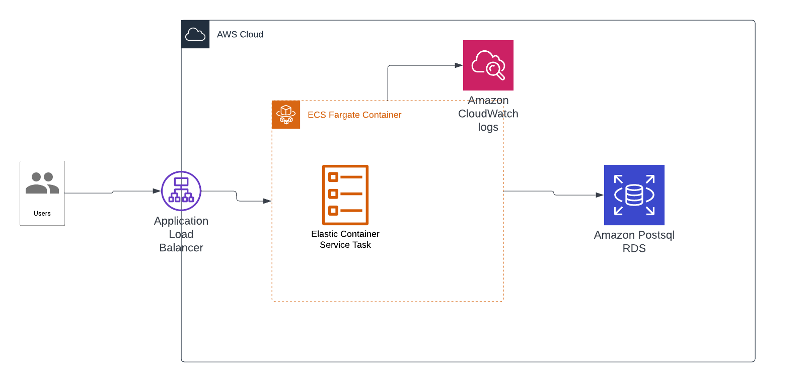

**DevOps-Challenge**
============================================================================
My attempt to DevOps-Tech-Challenge

High Level overview:


## Pre-requisites
* Terraform
* AWS CLI
* Docker
* Bash

## Optional
* infracost

## AWS Components
* ECS/Fargate
* Secrets Manager
* RDS Postgres
* CloudWatch Logs
* ALB

Initialise:
```console
make init
```

Build app container image:
```console
make build
```

To deploy:
```console
make all
```

Cleanup:
```console
make clean
```

## Introspection
What I was wanting to do was using different IaC tool that fall outside of my confort zone which is Terraform or Pulumi. Then tf is chosen because it commonly used in the DevOps space and also it is relatively easy to pick up. 

With more time and improvment from current architechture, few things can be added onto current stack
1. Tagging policy to identify the resource creation - terraform has a function/set using tag to re-use all over the place
2. ACM to enforce the communication over SSL
3. R53 to map the DNS on ALB
4. Extra resiliance setup in VPC
5. To understand a bit more of the GO app
6. WAF to protect our app
7. Backup consideration etc
8. Control over the tf state file to protect the resource as current, as to provent anyone fiddling around with the state file